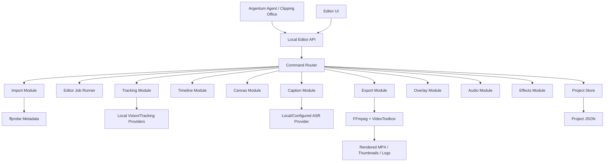
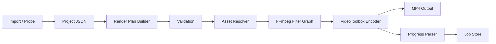
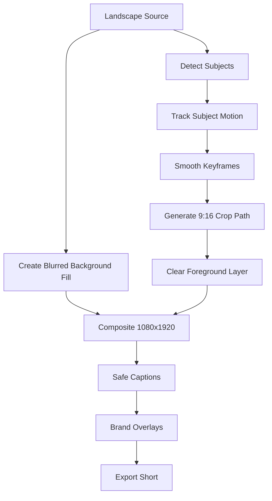

# Argentum Editor Architecture

Argentum Editor is the local, API-first video editing engine for Argentum OS and Clipping Office. It replaces fragile desktop automation and mouse macro workflows with deterministic editing commands, JSON projects, and FFmpeg-backed rendering.

This document is the build contract for the editor. Implementation should start only after this architecture is approved, and each phase must ship with tests before the next phase begins.

## Product Boundary

Argentum Editor is not a CapCut clone and not a consumer editor. It is an internal production engine built so Argentum agents can edit video by issuing commands.

The agent must never click editor UI controls, inspect pixels for workflow navigation, or rely on OCR to operate the editor. The UI is for operators to inspect projects, override values, and review output. Automation runs through the internal command/API layer.

## Goals

- Local-first macOS engine optimized for Apple Silicon.
- Offline-capable editing pipeline for local files.
- JSON project files that describe edits, not rendered output.
- Programmatic commands for every operation.
- Professional vertical-video output, especially 9:16 clips.
- Deterministic export behavior with progress, logs, and retryable failures.
- Modular architecture where import, timeline, canvas, tracking, captions, overlays, audio, effects, and export are independent modules.

## Non-Goals

- No browser automation.
- No CapCut automation.
- No mouse macro replay.
- No screen-recording based editing workflow.
- No external publishing in the editor engine.
- No credential storage inside editor project files.
- No destructive file writes outside approved output folders.

## Runtime Position In Argentum

Argentum Editor should live inside the existing local Argentum OS Electron/Node runtime.

- Electron shell: existing Argentum OS desktop app.
- Backend: Node.js local API bound to `127.0.0.1`.
- Frontend: React editor workspace mounted inside Argentum OS or Clipping Office.
- Engine: TypeScript services using FFmpeg/ffprobe and local worker queues.
- Storage: local app data folder for editor metadata, project index, job logs, thumbnails, proxies, and render caches.
- Media files: remain in user-approved folders or Clipping Office clip folders.

## Proposed Folder Structure

```text
apps/
  argentum-editor/
    package.json
    src/
      main/
        editor-app.ts
        editor-routes.ts
      renderer/
        EditorShell.tsx
        panels/
          AssetPanel.tsx
          PreviewPanel.tsx
          TimelinePanel.tsx
          InspectorPanel.tsx
          ExportPanel.tsx
      shared/
        editor-types.ts
        api-client.ts

services/
  argentum-editor/
    index.ts
    container.ts
    config.ts
    domain/
      project.ts
      timeline.ts
      canvas.ts
      asset.ts
      effect.ts
      caption.ts
      overlay.ts
      export.ts
      job.ts
    modules/
      import/
        import-service.ts
        metadata-prober.ts
        asset-validator.ts
      timeline/
        timeline-service.ts
        trim-service.ts
        split-service.ts
        undo-service.ts
      canvas/
        canvas-service.ts
        safe-zone-service.ts
      tracking/
        tracking-service.ts
        subject-detector.ts
        motion-smoother.ts
      reframe/
        auto-reframe-service.ts
        crop-planner.ts
      background/
        background-service.ts
        blur-background.ts
      captions/
        caption-service.ts
        transcript-provider.ts
        caption-layout.ts
      overlays/
        overlay-service.ts
        overlay-layout.ts
      audio/
        audio-service.ts
        loudness-normalizer.ts
      effects/
        effects-service.ts
        filter-graph-builder.ts
      export/
        export-service.ts
        ffmpeg-renderer.ts
        progress-parser.ts
        hardware-encoder.ts
      preview/
        preview-service.ts
        thumbnail-service.ts
        proxy-service.ts
      jobs/
        editor-job-runner.ts
        editor-job-store.ts
    api/
      projects.routes.ts
      assets.routes.ts
      timeline.routes.ts
      canvas.routes.ts
      tracking.routes.ts
      captions.routes.ts
      overlays.routes.ts
      effects.routes.ts
      audio.routes.ts
      exports.routes.ts
    storage/
      project-store.ts
      artifact-store.ts
      cache-store.ts
    tests/
      fixtures/
      import-service.test.ts
      timeline-service.test.ts
      filter-graph-builder.test.ts
      export-service.test.ts
      api-contract.test.ts

docs/
  argentum-editor-architecture.md
  argentum-editor-api.md
  argentum-editor-roadmap.md
```

## High-Level Module Diagram



## Core Project Model

Every project is a JSON document. Rendered videos are outputs, not the source of truth.

```json
{
  "schemaVersion": "argentum-editor-project-v1",
  "id": "project_...",
  "name": "Streamer highlight vertical",
  "createdAt": "2026-07-09T00:00:00.000Z",
  "updatedAt": "2026-07-09T00:00:00.000Z",
  "canvas": {
    "width": 1080,
    "height": 1920,
    "aspectRatio": "9:16",
    "safeZones": ["tiktok", "instagram_reels", "youtube_shorts"]
  },
  "assets": [
    {
      "id": "asset_...",
      "type": "video",
      "sourcePath": "/Volumes/ZYLO/Argentum/CLIPPING OFFICE /Clips/example.mp4",
      "metadata": {
        "durationMs": 30000,
        "width": 1920,
        "height": 1080,
        "fps": 60,
        "videoCodec": "h264",
        "audioCodec": "aac",
        "audioChannels": 2,
        "bitrate": 8000000
      }
    }
  ],
  "timeline": {
    "durationMs": 30000,
    "tracks": [
      {
        "id": "track_video_main",
        "type": "video",
        "clips": [
          {
            "id": "clip_...",
            "assetId": "asset_...",
            "startMs": 0,
            "inMs": 0,
            "outMs": 30000,
            "effects": ["effect_blur_background", "effect_reframe"]
          }
        ]
      }
    ]
  },
  "effects": [],
  "captions": [],
  "overlays": [],
  "audio": {},
  "exportSettings": {
    "preset": "short_1080x1920_h264",
    "codec": "h264",
    "hardwareAcceleration": true,
    "outputPath": ""
  }
}
```

## Editing Command Model

Every operation returns a structured response.

```ts
type EditorResult<T> = {
  ok: true;
  data: T;
  warnings: EditorWarning[];
  requestId: string;
} | {
  ok: false;
  error: {
    code: string;
    message: string;
    details?: Record<string, unknown>;
    retryable: boolean;
  };
  requestId: string;
};
```

Commands must be deterministic, logged, and replayable:

- `CreateProject`
- `ImportVideo`
- `ImportFolder`
- `AddTimelineClip`
- `TrimClip`
- `SplitClip`
- `MoveClip`
- `SetCanvas`
- `ApplySafeZones`
- `DetectSubjects`
- `TrackSubject`
- `AutoReframe`
- `BlurBackground`
- `GenerateCaptions`
- `ApplyCaptionTheme`
- `AddOverlay`
- `NormalizeAudio`
- `ApplyEffect`
- `CreatePreview`
- `ExportVideo`

## Local API Specification

All routes are local-only and require the existing Argentum authenticated session.

### Projects

| Method | Route | Purpose |
| --- | --- | --- |
| `POST` | `/api/editor/projects` | Create a JSON project. |
| `GET` | `/api/editor/projects` | List local editor projects. |
| `GET` | `/api/editor/projects/:projectId` | Read project JSON and status. |
| `PATCH` | `/api/editor/projects/:projectId` | Update name, tags, canvas, or export defaults. |
| `POST` | `/api/editor/projects/:projectId/duplicate` | Duplicate project JSON without copying source media. |

### Import

| Method | Route | Purpose |
| --- | --- | --- |
| `POST` | `/api/editor/projects/:projectId/assets/import` | Import one file by local path. |
| `POST` | `/api/editor/projects/:projectId/assets/import-folder` | Import supported files from a folder. |
| `GET` | `/api/editor/projects/:projectId/assets` | List project assets and metadata. |
| `POST` | `/api/editor/assets/probe` | Probe media metadata without importing. |

### Timeline

| Method | Route | Purpose |
| --- | --- | --- |
| `POST` | `/api/editor/projects/:projectId/timeline/clips` | Add asset to a timeline track. |
| `PATCH` | `/api/editor/projects/:projectId/timeline/clips/:clipId` | Trim, move, mute, resize, or set layer order. |
| `POST` | `/api/editor/projects/:projectId/timeline/clips/:clipId/split` | Split clip at a frame/time. |
| `DELETE` | `/api/editor/projects/:projectId/timeline/clips/:clipId` | Ripple or non-ripple delete from timeline. |
| `POST` | `/api/editor/projects/:projectId/timeline/undo` | Undo last command. |
| `POST` | `/api/editor/projects/:projectId/timeline/redo` | Redo last command. |

### Canvas And Reframe

| Method | Route | Purpose |
| --- | --- | --- |
| `POST` | `/api/editor/projects/:projectId/canvas` | Set aspect ratio, resolution, and safe zones. |
| `POST` | `/api/editor/projects/:projectId/tracking/subjects` | Detect people, faces, HUD, cursor, webcams, or objects. |
| `POST` | `/api/editor/projects/:projectId/tracking/:trackId/reframe` | Generate smooth auto-reframe keyframes. |
| `POST` | `/api/editor/projects/:projectId/background/blur` | Add blurred background for vertical conversion. |

### Captions, Overlays, Audio, Effects

| Method | Route | Purpose |
| --- | --- | --- |
| `POST` | `/api/editor/projects/:projectId/captions/generate` | Generate transcript and word timings. |
| `PATCH` | `/api/editor/projects/:projectId/captions/:captionTrackId/theme` | Apply caption style/theme. |
| `POST` | `/api/editor/projects/:projectId/overlays` | Add image, GIF, video, logo, sticker, or watermark overlay. |
| `PATCH` | `/api/editor/projects/:projectId/overlays/:overlayId` | Edit position, scale, timing, animation, or opacity. |
| `POST` | `/api/editor/projects/:projectId/audio/normalize` | Normalize loudness and apply compressor/limiter. |
| `POST` | `/api/editor/projects/:projectId/effects` | Add blur, color, opacity, motion, or transition effect. |

### Preview And Export

| Method | Route | Purpose |
| --- | --- | --- |
| `POST` | `/api/editor/projects/:projectId/preview/frame` | Render one preview frame. |
| `POST` | `/api/editor/projects/:projectId/preview/proxy` | Generate proxy media for long clips. |
| `POST` | `/api/editor/projects/:projectId/export` | Queue export job. |
| `GET` | `/api/editor/jobs/:jobId` | Read job status, progress, logs, ETA, and output paths. |
| `POST` | `/api/editor/jobs/:jobId/cancel` | Cancel a running export or analysis job. |

## Rendering Pipeline



### Render Plan Stages

1. Load project JSON and validate schema.
2. Resolve asset paths and verify read permission.
3. Resolve canvas dimensions and safe zones.
4. Compile timeline clips into stream maps.
5. Compile effects into FFmpeg filter graph nodes.
6. Compile captions into ASS/WebVTT or drawtext filters.
7. Compile overlays into scaled overlay filter chains.
8. Select encoder:
   - Apple Silicon hardware: `h264_videotoolbox` or `hevc_videotoolbox`.
   - CPU fallback: `libx264` or `libx265`.
9. Run export as a background job with structured progress.
10. Verify output exists, duration matches tolerance, dimensions match target, and file is playable.

### Vertical 9:16 Reframe Pipeline



## Module Responsibilities

### Import Module

- Accept MP4, MOV, MKV, AVI, and WEBM.
- Use ffprobe to read duration, streams, codec, FPS, bitrate, resolution, rotation, color space, and audio channel layout.
- Reject unreadable, unsupported, missing, or remote paths.
- Generate thumbnails and lightweight asset records.

### Timeline Module

- Maintain frame-accurate clips on multiple tracks.
- Support unlimited video, overlay, and audio tracks in JSON.
- Provide trim, split, move, ripple delete, snapping, and undo/redo as commands.
- Never mutate source media.

### Canvas Module

- Support 9:16, 16:9, 1:1, 4:5, and custom dimensions.
- Expose safe zones for TikTok, Instagram Reels, and YouTube Shorts.
- Adapt track layout when canvas changes.

### Tracking Module

- Track people, faces, objects, cursor, gaming HUD, and streamer webcam regions.
- The first implementation can use provider interfaces with a local deterministic fixture provider for tests, then add real local model adapters later.
- Must output time-based bounding boxes and confidence scores, not UI-only state.

### Auto Reframe Module

- Convert tracking results into crop keyframes.
- Keep heads and webcams inside frame.
- Smooth motion with velocity and acceleration limits.
- Avoid jitter by dampening low-confidence detections.

### Background Module

- Build vertical backgrounds without stretching foreground footage.
- Support blur strength, brightness, saturation, opacity, and optional gradient overlays.
- Compose background and foreground as separate layers.

### Caption Module

- Generate transcript segments and word timings through a provider interface.
- Support local ASR first when available, with cloud providers optional and clearly labeled.
- Render captions using ASS styles or FFmpeg drawtext depending on feature need.

### Overlay Module

- Support PNG, SVG, images, GIFs, videos, logos, watermarks, and animated stickers.
- Position by percentages and alignment presets.
- Validate safe-zone collisions before export.

### Audio Module

- Normalize loudness.
- Apply noise reduction, compressor, limiter, gain automation, fade in, and fade out.
- Preserve sync with timeline trims.

### Effects Module

- Compile blur, brightness, contrast, exposure, sharpen, vignette, saturation, temperature, opacity, motion blur, and basic transitions into render graph nodes.

### Export Module

- Queue exports.
- Run background jobs.
- Report progress and ETA.
- Support 1080x1920, 1440p, 4K, H.264, H.265, and hardware encoding when available.
- Verify rendered output.

## UI Architecture

The editor UI should be a professional workspace, but the UI is secondary to the command engine.

```text
Left Sidebar: Assets, Captions, Overlays, Effects, Exports
Center: Preview canvas with safe zones
Bottom: Timeline tracks
Right: Inspector for selected project/clip/effect/export job
Top Bar: Project name, undo/redo, save state, export queue
```

UI rules:

- No macro training UI.
- No CapCut workspace.
- No fake controls.
- UI controls call the same editor API that agents use.
- Preview must show project JSON state, not uncontrolled DOM-only edits.

## Security And Safety

- Editor API binds only through the existing local Argentum server.
- No secrets in project JSON.
- File access must stay inside approved local folders or existing Clip Office output folders.
- Exports write only to approved output folders.
- Delete operations require explicit local command intent and must be logged.
- External publishing is outside Argentum Editor and remains Human Gate controlled.

## Test Strategy

### Unit Tests

- Project schema validation.
- Metadata probing.
- Timeline edit commands.
- Canvas dimension conversion.
- Filter graph generation.
- Export command validation.
- API response envelopes.

### Integration Tests

- Import a fixture MP4 and verify metadata.
- Create 9:16 project from landscape fixture.
- Add blurred background and overlay.
- Export with CPU fallback.
- Verify output dimensions, codec, duration tolerance, and playable file.

### Performance Tests

- Long source import without full decode.
- Export progress parser.
- Batch import.
- Memory ceiling during export.

### Agent Contract Tests

- Agent command sequence can create a project, import a clip, set 9:16 canvas, add background, add overlay, normalize audio, export, and verify output without UI interaction.

## Development Roadmap

### Phase 0: Approval And Cleanup

- Approve this architecture.
- Mark CapCut macro automation as deprecated in docs.
- Define editor output root and local cache root.
- Decide whether TypeScript is introduced in the root package or isolated under `apps/argentum-editor`.

Exit criteria:

- Architecture accepted.
- No new macro or CapCut UI added.

### Phase 1: Project, Import, Metadata, And API Foundation

- Add TypeScript editor service skeleton.
- Add project JSON schema and validator.
- Add ffprobe metadata import for MP4, MOV, MKV, AVI, WEBM.
- Add routes:
  - `POST /api/editor/projects`
  - `POST /api/editor/projects/:projectId/assets/import`
  - `GET /api/editor/projects/:projectId`
- Add tests with fixture media.

Exit criteria:

- Agent can create project and import video through API.
- Project JSON persists locally.
- Metadata is real.

### Phase 2: Timeline And Canvas

- Add timeline tracks and clip commands.
- Add 9:16, 16:9, 1:1, 4:5, custom canvas.
- Add safe-zone model.
- Add undo/redo command history.

Exit criteria:

- Agent can create a 9:16 project and place a clip frame-accurately.

### Phase 3: First Real Export

- Add render plan builder.
- Add FFmpeg filter graph for a basic timeline.
- Add export queue and progress parser.
- Add output verification.
- Support VideoToolbox hardware encoding with CPU fallback.

Exit criteria:

- Agent can export a valid 1080x1920 H.264 MP4 from a project JSON.

### Phase 4: Vertical Background And Reframe

- Add blurred background generation.
- Add deterministic crop/reframe commands.
- Add provider interface for tracking results.
- Add smoothing and crop safety rules.

Exit criteria:

- Agent can convert a landscape clip to vertical with blurred background and stable foreground crop.

### Phase 5: Captions, Overlays, Audio

- Add caption provider interface and timed caption model.
- Add caption rendering.
- Add overlay system with percentage positioning.
- Add audio normalization and fades.

Exit criteria:

- Agent can produce a branded captioned short through API only.

### Phase 6: Editor UI

- Build React workspace:
  - assets
  - preview
  - timeline
  - inspector
  - export queue
- UI calls the same API as agents.

Exit criteria:

- Operator can inspect and adjust a JSON project without macro tools.

### Phase 7: Clipping Office Integration

- Replace Builder handoff with Editor project creation.
- Approved clip creates an Argentum Editor project.
- Agent runs command recipe:
  - import clip
  - set 9:16
  - auto reframe
  - blur background
  - captions
  - branding
  - export
- Clip Radar and Builder show real editor job state and verified output.

Exit criteria:

- Clipping Office can generate a finished local MP4 through Argentum Editor with no CapCut dependency.

## First Implementation Slice After Approval

Build Phase 1 only:

1. Add editor project schema.
2. Add project store in app data.
3. Add import service using ffprobe.
4. Add local API routes.
5. Add tests proving metadata and JSON persistence.

Do not begin tracking, captions, auto reframe, UI, or export until the import/project foundation is verified.
