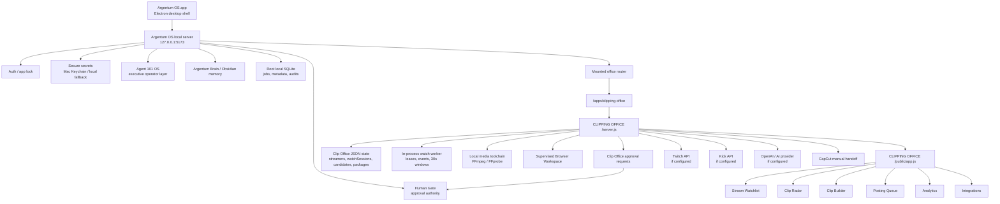
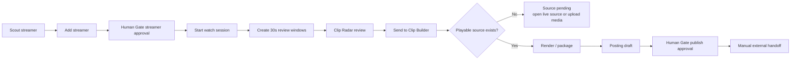
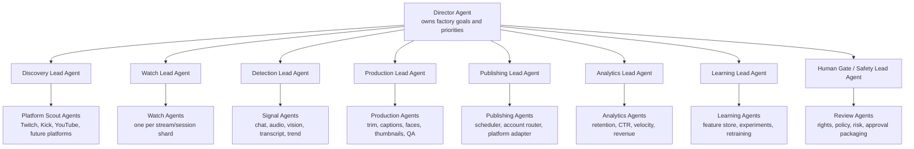
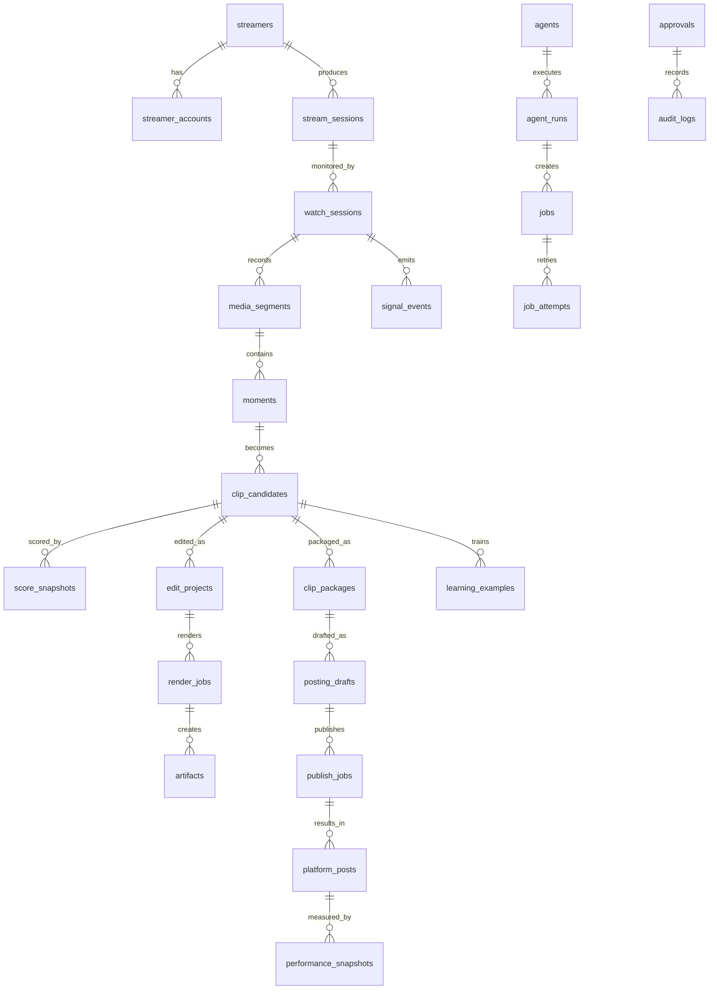
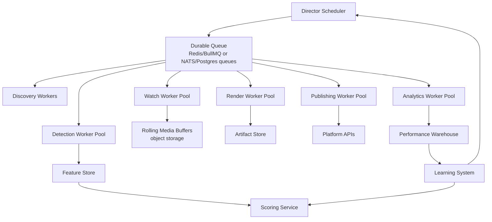
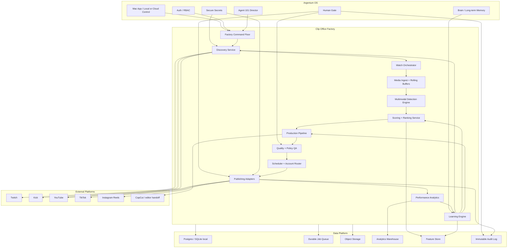

# Argentum Clip Office Autonomous Factory Audit

Date: 2026-06-24

Scope: Clip Office / StreamClipper inside Argentum OS.

Operating rule: Clip Office is a separate office mounted inside Argentum OS. Argentum OS owns the Mac app, authentication, secure secrets, Agent 101, Human Gate, local runtime, and office routing. Clip Office owns streamer discovery, watch sessions, clip candidates, media sources, render jobs, packages, posting drafts, approvals requested by the office, and clipping-specific intelligence.

## Executive Verdict

The current Clip Office is a truthful supervised local clipping prototype. It is not yet an autonomous clipping factory.

It can:

- Run locally inside Argentum OS.
- Manage streamers, permission status, and monitoring state.
- Use Twitch/Kick provider configuration when present.
- Start watch sessions for approved streamers.
- Create 30-second source-pending windows.
- Score local candidates with basic heuristic scoring.
- Send candidates into Clip Builder.
- Render/package only when playable local media exists.
- Create posting drafts and Human Gate approval requests.
- Keep dangerous public actions gated.
- Show explicit blockers instead of faking live media or publishing.

It cannot yet:

- Reliably watch hundreds of real streams with distributed workers.
- Capture and store playable live video buffers at scale.
- Detect viral moments from audio, video, chat, and stream context in real time.
- Produce finished clips automatically end to end.
- Publish directly to TikTok, YouTube Shorts, Instagram Reels, or other platforms.
- Learn from actual platform performance data.
- Run a production-grade scheduler, duplicate detector, account router, or experiment engine.
- Survive multi-worker concurrency on its current JSON-first persistence layer.

The next system should be built as a factory: Director -> Discovery -> Watch -> Detection -> Scoring -> Production -> QA -> Scheduling -> Human Gate -> Publishing -> Analytics -> Learning.

## 1. Current Architecture Map



Current production chain:



Current hard truth: watch sessions can create real review records, but a review window is not a finished clip until a playable media source exists.

## 2. Missing Systems Report

| System | Current status | Missing capability | Required future system |
| --- | --- | --- | --- |
| Stream discovery | Partial Twitch/Kick discovery | YouTube, TikTok Live, category trend discovery, streamer churn replacement | Multi-platform Discovery Service |
| Live monitoring | Local in-process sessions, 50 local cap | Distributed session scheduling, durable leases, per-platform capacity, reconnect strategy | Watch Orchestrator and Watch Agent pool |
| Playable buffer capture | Source-pending windows if no media | Authorized live capture, rolling buffers, exact timestamp extraction | Media Ingest and Rolling Buffer Service |
| Moment detection | Basic heuristic/event windows | Multimodal detection for emotion, rage, clutch, chat spikes, donation reactions | Real-time Detection Engine |
| Clip scoring | Basic candidate scores | Multi-score framework, historical learning, platform-specific ranking | Clip Scoring and Ranking Service |
| Production pipeline | Local verified media render path | Auto trim, face tracking, captions, hooks, thumbnails, quality gates | Production Factory Pipeline |
| Publishing | Drafts and Human Gate only | OAuth connectors, platform scheduling, idempotent publish records, reconciliation | Publishing Orchestrator |
| Analytics | Local dashboard metrics | Platform performance ingestion, retention, completion, CTR, revenue attribution | Performance Data Warehouse |
| Learning loop | Feedback records exist but no learning engine | Feature store, model evaluation, experiment engine, weekly strategy updates | Learning and Optimization System |
| Storage | Local uploads/outputs | Object storage, lifecycle rules, checksums, thumbnail/frame index | Media Storage Service |
| Queue | Local/in-process | Durable queues, retries, dead letters, priorities, backpressure | Job Queue and Worker Runtime |
| Observability | Logs and smoke checks | Metrics, traces, alerts, SLA dashboards, incident workflows | Operations Monitoring Stack |
| Permissions | Human Gate and local auth | Role-based office permissions, per-agent scopes, publishing permission matrix | Permission and Policy Service |

## 3. Missing Agents Report

Current Agent 101 is the office operator and can invoke Clip Office workflows. That is overloaded for a factory.

Required hierarchy:



Agent inventory:

| Agent | Exists now | Should exist | Responsibility |
| --- | --- | --- | --- |
| Agent 101 Director | Partial | Yes | Executive operator, reports, bottleneck decisions |
| Streamer Scout | Partial | Split per platform | Find live creators worth monitoring |
| Watch Agent | Partial in backend | Yes, many instances | Maintain one or more stream sessions |
| Detection Agent | Missing | Yes | Convert live signals into candidate moments |
| Scoring Agent | Partial | Yes | Calculate virality and risk scores |
| Clip Producer Agent | Partial | Yes | Build finished edit assets from sources |
| Caption Agent | Partial/manual | Yes | Generate, style, and verify captions |
| Thumbnail Agent | Missing | Yes | Generate thumbnails and cover frames |
| QA Agent | Missing | Yes | Verify media, captions, audio, render, policy |
| Publishing Agent | Missing/gated | Yes | Draft/schedule/publish only under approved policy |
| Analytics Agent | Partial dashboard | Yes | Read real performance and detect winners/losers |
| Learning Agent | Missing | Yes | Feed outcomes back into discovery/scoring/production |
| Rights Agent | Partial Human Gate | Yes | Track source rights, platform permissions, claims risk |
| Incident Agent | Missing | Yes | Detect failures, retry, alert, and escalate |

## 4. Missing Databases Report

The current Clip Office state model is useful for a prototype but not enough for a multi-worker factory. Clip Office should move from JSON-first persistence to a relational/event architecture.

Minimum production database blueprint:



Required tables:

| Table | Purpose | Key indexes |
| --- | --- | --- |
| `streamers` | Canonical creator/channel record | platform, channel_id unique; status; language |
| `streamer_accounts` | Per-platform auth/identity metadata | streamer_id, platform, external_id |
| `stream_permissions` | Rights, allowed uses, expiry, evidence | streamer_id, status, expires_at |
| `stream_sessions` | Provider live session/VOD sessions | platform_stream_id unique, streamer_id, started_at |
| `watch_sessions` | Worker lease and monitoring state | status, worker_id, streamer_id, lease_expires_at |
| `media_sources` | Uploaded or captured sources | sha256, provenance, streamer_id |
| `media_segments` | Rolling 30s/60s source chunks | watch_session_id, segment_start, buffer_status |
| `signal_events` | Chat/audio/video/transcript signals | watch_session_id, event_type, timestamp |
| `moments` | Raw detected moments before clip candidate | watch_session_id, score, timestamp |
| `clip_candidates` | Candidate clips shown in Radar | status, streamer_id, score, created_at |
| `score_snapshots` | Versioned scoring output | candidate_id, score_type, model_version |
| `edit_projects` | Builder project state and EDL | candidate_id, status, updated_at |
| `render_jobs` | Render queue jobs | status, priority, candidate_id |
| `artifacts` | Output files, captions, thumbnails | type, sha256, candidate_id |
| `clip_packages` | Approved package bundle | candidate_id, status |
| `posting_drafts` | Platform-specific post drafts | platform, scheduled_for, approval_status |
| `publish_jobs` | Idempotent publishing jobs | platform, status, scheduled_for |
| `platform_posts` | Real published URLs/IDs | platform, external_post_id unique |
| `performance_snapshots` | Views, retention, CTR, likes, shares | platform_post_id, captured_at |
| `learning_examples` | Training/evaluation rows | candidate_id, outcome_label, feature_version |
| `jobs` | Durable work queue | queue, status, priority, run_after |
| `job_attempts` | Retries, errors, durations | job_id, attempt_number |
| `agents` | Agent registry and permissions | agent_type, status |
| `agent_runs` | Agent executions and outputs | agent_id, status, started_at |
| `approvals` | Human Gate decisions | status, risk_level, action_type |
| `audit_logs` | Immutable action history | actor_id, action, created_at |
| `incidents` | Failure and alert tracking | severity, status, owner |

Critical missing indexes:

- `watch_sessions(status, lease_expires_at)`
- `media_segments(watch_session_id, segment_start_seconds)`
- `clip_candidates(status, score, created_at)`
- `score_snapshots(candidate_id, model_version)`
- `jobs(queue, status, priority, run_after)`
- `publish_jobs(platform, status, scheduled_for)`
- `performance_snapshots(platform_post_id, captured_at)`
- `stream_permissions(streamer_id, status, expires_at)`
- `audit_logs(created_at, actor_id, action)`

## 5. Missing UI Report

Current UI is usable but still page/dashboard oriented. A factory needs visible work movement.

Missing UI surfaces:

- Factory floor map: departments, active agents, current throughput, bottlenecks.
- Stream wall: hundreds of streams grouped by platform/category/priority.
- Watch agent console: worker health, stream leases, reconnects, capture lag.
- Signal timeline: chat spikes, audio spikes, transcript markers, visual detections.
- Moment queue: raw moments before candidate creation.
- Scoring inspector: each score component and why it changed.
- Production kanban: source -> cut -> captions -> render -> QA -> package.
- Publishing calendar: platform/account capacity, approval deadlines, scheduled posts.
- Learning board: winners, losers, model changes, experiment results.
- Rights and safety console: permissions, expiry, claims risk, blocked creators.
- Incident command: failures, retries, dead letters, stuck jobs.
- Capacity planner: CPU/GPU/network/storage usage and next bottleneck.

UI design rule: every page should answer four questions without scrolling:

1. What is working right now?
2. What is blocked?
3. What is the highest-leverage next action?
4. Which agent owns it?

## 6. Missing Automation Report

Required automation chains:

| Automation | Current state | Future behavior |
| --- | --- | --- |
| Replace dead streamers | Missing | If streamer offline too long, scout replacement and request approval |
| Watch scheduling | Partial | Allocate workers to live streams by priority and capacity |
| Rolling capture | Missing | Maintain authorized rolling buffers per stream |
| Moment detection | Partial | Convert multimodal signals into scored moments |
| Auto trim | Missing | Find best start/end around detected moment |
| Caption generation | Partial | Generate, style, burn-in, and QA captions |
| Face/speaker tracking | Missing | Reframe subject for 9:16 automatically |
| Duplicate prevention | Missing | Check source, transcript, visual hash, title similarity |
| Draft creation | Partial | Create platform-specific caption/title/hashtags |
| Schedule optimization | Missing | Assign post time by platform/account/audience |
| Publishing | Blocked/gated | Publish through adapters only after approval policy permits |
| Performance ingest | Missing | Pull metrics from platforms at 1h/6h/24h/7d |
| Learning update | Missing | Update scorer weights and discovery targets weekly |
| Incident recovery | Partial | Retry, dead-letter, alert, and produce operator report |

## 7. Scaling Report

### Can the current system monitor 1 streamer?

Yes, for supervised local workflows. One approved live streamer can be monitored, a watch session can exist, and 30-second review windows can be created. If playable capture is unavailable, the system honestly marks source pending.

### Can it monitor 10?

Maybe locally for metadata and review windows, depending on provider calls and local process health. It is not architected for 10 simultaneous video captures.

### Can it monitor 100?

No, not as currently implemented. JSON-first state, in-process workers, local file storage, and single-process API handling become failure points.

### Can it monitor 1000?

No. A 1000-stream factory needs distributed ingestion, queueing, object storage, shardable workers, a database, metrics, and autoscaling.

### Scale failure points

- JSON state write contention.
- Single-process watch scheduling.
- No durable queue or dead-letter system.
- No distributed worker leases beyond local process assumptions.
- No real media capture buffer architecture.
- Local disk storage cannot support large continuous video buffers.
- No platform API rate-limit budget manager.
- No backpressure between discovery, watching, detection, rendering, and publishing.
- No GPU/CPU capacity manager for AI detection and rendering.
- No data warehouse for outcomes.

### Required worker architecture



Capacity plan:

| Stream count | Required architecture |
| --- | --- |
| 1-5 | Local mode, SQLite/JSON acceptable for development |
| 10-25 | SQLite plus durable local jobs, bounded media capture, watchdogs |
| 50 | Postgres, object storage, queue workers, one render worker pool |
| 100 | Distributed watch workers, separate detection/render queues, metrics |
| 500 | Sharded watch orchestrator, GPU workers, multi-region object storage |
| 1000+ | Autoscaled worker pools, per-platform rate-limit budgeting, warehouse and learning loop |

## 8. Security Report

Current strengths:

- Local mode binds to localhost through Argentum OS.
- API keys are intended to stay server-side.
- Local secrets can use Mac Keychain.
- Frontend receives configured/not-configured status, not raw secrets.
- Human Gate blocks publishing, spending, account changes, and other high-risk actions.
- Practice/demo state is labeled separately.

Critical risks:

- Clip Office still has JSON-first persistence for office data.
- Provider credentials need rotation, scoping, and audit trails.
- Browser Workspace must never become a silent account automation tool.
- Publishing adapters would introduce OAuth refresh token and account-risk exposure.
- Media storage needs permissions, checksums, malware scanning, and lifecycle rules.
- Agents need explicit scoped capabilities, not broad access to every route.
- Human Gate needs role-based approvals for production teams.
- Rights evidence must be first-class before automatic publishing.

Required fixes:

1. Add a permission matrix for every agent and endpoint.
2. Split read, write, render, publish, admin, and credential scopes.
3. Store provider OAuth tokens encrypted and versioned.
4. Add credential rotation and revoke workflows.
5. Add signed webhook verification for platform callbacks.
6. Add audit records for every file, source, credential, approval, publish, and delete action.
7. Add rights evidence tables and block publishing when rights are missing or expired.
8. Keep direct publishing behind Human Gate unless a pre-approved policy explicitly permits a low-risk action.
9. Add content safety checks before export and before publish.
10. Add incident reporting for suspicious agent behavior.

## 9. Reliability Report

Failure scenarios and required recovery:

| Failure | Current behavior | Required recovery |
| --- | --- | --- |
| Stream disconnect | Session can degrade/reconnect locally | Persist reconnect strategy, segment gap, retry budget |
| Provider API down | Shows blocker | Use cached last-known status, retry with backoff, alert if stale |
| Rate limit | Partial handling | Central rate-limit budget manager per provider/token |
| Corrupt media | Render blocked by FFprobe | Quarantine media, mark source failed, retry alternate capture |
| Agent crash | Local run may stop | Durable run state, resume from last completed step |
| Server crash | Local state reloads | Startup recovery for active leases and incomplete jobs |
| Storage full | Not production-managed | Capacity alerts, lifecycle cleanup, object storage tiering |
| Bad clip flood | Manual deletion | Quality threshold, duplicate suppression, auto-prune queue |
| Publishing failure | Publishing mostly blocked | Idempotent publish jobs, retry classes, reconciliation |
| Bad model output | Human Gate catches some | Eval gates, prompt/model versioning, confidence thresholds |

Reliability target:

- No silent failure.
- Every failed job has an owner, retry status, and next action.
- Every candidate must be traceable to source, signals, scorer version, and approval state.
- Every publish must be idempotent and reconciled against platform state.

## 10. Complete Future Architecture



## 11. Detection Engine Design

Signal categories:

| Signal | Examples | Required data |
| --- | --- | --- |
| Chat velocity | messages/sec, emote bursts, repeat phrases | chat stream with timestamps |
| Audio intensity | loudness spike, laughter, shouting, silence break | audio waveform and VAD |
| Speech/transcript | quotes, punchlines, drama phrases | ASR transcript with word timestamps |
| Visual action | game clutch, fail, face reaction, scene change | sampled frames, object/action model |
| Stream metadata | category, title, viewer count, stream age | provider API |
| Social trend | trending memes, current events, popular sounds | trend crawler/API |
| Historical creator fit | prior clips, average views, audience style | internal performance history |
| Risk | profanity, policy, copyright, rights ambiguity | moderation and rights data |

Moment detection stages:

1. Segment stream into rolling windows.
2. Extract audio, frame, chat, transcript, and metadata features.
3. Generate raw signal events.
4. Merge adjacent signal events into moments.
5. Score moment confidence by signal agreement.
6. Promote only top moments into Clip Radar candidates.
7. Store evidence for every promoted and rejected moment.

Moment classes:

- Funny
- Rage
- Drama
- Clutch
- Fail
- Emotional reaction
- Donation/sub reaction
- Creator collaboration
- Chat explosion
- Hot take
- Visual surprise
- Trend-aligned quote

## 12. Scoring Framework

Overall score:

```text
Factory Score =
  0.20 Virality
+ 0.15 Hook
+ 0.15 Retention
+ 0.10 Emotion
+ 0.10 Novelty
+ 0.10 Trend Alignment
+ 0.08 Creator Fit
+ 0.07 Production Feasibility
+ 0.05 Safety/Rights Confidence
```

Score definitions:

| Score | Inputs | Output |
| --- | --- | --- |
| Virality | chat spike, viewer count, novelty, title strength | likelihood of high reach |
| Hook | first 1-3 seconds, visual clarity, line strength | chance user stops scrolling |
| Retention | pacing, payoff timing, length, narrative arc | chance user completes clip |
| Emotion | laughter, anger, surprise, intensity | strength of reaction |
| Novelty | similarity to recent clips, meme saturation | freshness |
| Trend Alignment | category trends, platform trends, hashtags | trend fit |
| Competition | number of similar clips already posted | saturation risk |
| Publishing | account fit, best time, platform format | posting opportunity |
| Safety/Rights | permission, claims risk, moderation | publishability |

Every score must store:

- Input features.
- Scorer version.
- Model version.
- Weight version.
- Confidence.
- Explanation.
- Human override, if any.

## 13. Production Factory Design

Production stages:

```mermaid
flowchart LR
  Source["Verified source"] --> Trim["Auto trim"]
  Trim --> Reframe["9:16 face/action tracking"]
  Reframe --> Captions["Captions + styling"]
  Captions --> Hooks["Title / hook / description"]
  Hooks --> Thumb["Thumbnail / cover frame"]
  Thumb --> Render["Render variants"]
  Render --> QA["Technical + policy QA"]
  QA --> Package["Package"]
  Package --> Schedule["Schedule"]
  Schedule --> Approval["Human Gate"]
  Approval --> Publish["Publish / handoff"]
```



Parallelizable work:

- Transcript generation and frame sampling.
- Face/object tracking and chat analysis.
- Hook/title/description generation.
- Thumbnail selection.
- Multiple render variants.
- QA checks.

Non-parallel gates:

- Rights verification.
- Source verification.
- Final publish approval.
- Platform account action.

## 14. 30-Day Build Plan

Goal: turn the current local prototype into a truthful local factory foundation.

Week 1:

- Move Clip Office state from JSON-first to SQLite tables in local mode.
- Add database migrations for streamers, watch sessions, candidates, media sources, jobs, approvals, audit logs.
- Add a job table and local durable queue.
- Add worker heartbeat, lease, retry, and dead-letter records.
- Add Factory Health API.

Week 2:

- Build rolling media segment model.
- Add source segment lifecycle: pending, playable, corrupt, expired.
- Add segment-level audit logs.
- Add detection input schema for chat/audio/video/transcript signals.
- Add UI for Watch Agent health and source buffer status.

Week 3:

- Implement Moment model separate from Clip Candidate.
- Add signal scoring records.
- Add duplicate suppression by source window and text similarity.
- Add Clip Radar filter for raw moment, promoted candidate, dismissed, packaged.
- Add score explanation panel.

Week 4:

- Build Production Pipeline state machine.
- Add QA checklist records.
- Add render job retries and failure reasons.
- Add Builder queue performance improvements for 50+ clips.
- Add `npm run audit:clip-office-factory` validation checks.

## 15. 60-Day Build Plan

Goal: make Clip Office produce real clips from authorized sources with a measurable pipeline.

Weeks 5-6:

- Add provider-specific Discovery adapters: Twitch, Kick, YouTube.
- Add platform rate-limit budget records.
- Add Streamer Replacement automation.
- Add Watch Scheduler that assigns streamers by priority and capacity.

Weeks 7-8:

- Add authorized live/VOD capture pipeline.
- Add FFmpeg rolling buffer process supervision.
- Store segments in app-data locally and object storage in cloud mode.
- Add transcript extraction with word timestamps.
- Add chat ingest where platform/API permission allows.

Weeks 9-10:

- Implement multimodal detection features: chat velocity, audio spike, transcript hook, scene change, visual intensity.
- Add moment merge/dedupe logic.
- Add score snapshots and scorer versions.
- Add model-eval fixtures for known good/bad moments.

Weeks 11-12:

- Add auto trim and vertical reframe.
- Add caption style engine.
- Add render variants.
- Add QA Agent: duration, loudness, black frames, caption overlap, source proof, rights proof.
- Add package quality score and block publish when QA fails.

## 16. 90-Day Build Plan

Goal: operate a supervised autonomous content company with learning loops.

Weeks 13-14:

- Add platform account model and account routing.
- Add posting calendar and schedule optimizer.
- Add TikTok/YouTube Shorts/Instagram draft adapters.
- Keep final public publish behind Human Gate until explicit policy permits otherwise.

Weeks 15-16:

- Add platform performance ingestion.
- Add metrics snapshots: views, watch time, completion, likes, comments, shares, followers, CTR.
- Add dashboard for winner/loser analysis.
- Add attribution from post back to candidate, moment, streamer, score version, and render variant.

Weeks 17-18:

- Add Learning Engine.
- Train baseline ranking model from internal outcomes.
- Add weekly strategy report: streamers to add/remove, clip styles to increase/decrease, score weights to adjust.
- Add experiment engine for captions, hooks, thumbnails, and posting time.

Weeks 19-20:

- Add distributed worker mode.
- Add object storage.
- Add Postgres/cloud database path.
- Add observability: metrics, traces, alerts, incident dashboard.
- Add disaster recovery and backup verification.

## 17. Critical Priority Ranking

P0:

1. Move Clip Office persistence to database tables.
2. Add durable jobs, retries, and dead letters.
3. Build source segment model and capture truth model.
4. Split Moment from Clip Candidate.
5. Add immutable audit and rights evidence.

P1:

6. Add Watch Scheduler and worker health UI.
7. Add detection features and score snapshots.
8. Add duplicate suppression.
9. Add Production Pipeline state machine.
10. Add QA Agent.

P2:

11. Add platform discovery beyond Twitch/Kick.
12. Add performance ingestion.
13. Add learning feature store.
14. Add scheduler/account routing.
15. Add publishing adapters behind Human Gate.

P3:

16. Add distributed worker mode.
17. Add object storage/cloud mode scaling.
18. Add advanced multimodal models.
19. Add experimentation and bandit optimization.
20. Add multi-office enterprise command floor.

## 18. Exact Implementation Steps

### A. Database migration

1. Create `CLIPPING OFFICE /services/database.js`.
2. Add local SQLite adapter using the Argentum local app-data folder.
3. Add migration table `schema_migrations`.
4. Create tables listed in the database blueprint.
5. Write JSON import migration from existing Clip Office state.
6. Replace direct `state.*` writes with repository functions one domain at a time.
7. Keep JSON export backup after every migration.
8. Add tests for migration idempotency and data preservation.

### B. Durable job queue

1. Add `jobs` and `job_attempts` tables.
2. Add `enqueueJob`, `claimJob`, `completeJob`, `failJob`, `deadLetterJob`.
3. Add queues: `discovery`, `watch`, `ingest`, `detect`, `score`, `render`, `qa`, `publish`, `analytics`, `learning`.
4. Replace direct long-running work with jobs.
5. Add retry policy per queue.
6. Add UI for active, retrying, failed, and dead-letter jobs.
7. Add tests for crash-resume behavior.

### C. Watch orchestration

1. Add `watch_agents` registry.
2. Add `watch_assignments`.
3. Add `watch_sessions.lease_expires_at`.
4. Add a scheduler that chooses streamers by priority.
5. Add platform rate-limit budget checks before provider calls.
6. Add per-session heartbeat and lag metrics.
7. Add recovery that reclaims stale sessions.
8. Add UI for worker health and reconnect count.

### D. Media ingest

1. Add `media_segments` table.
2. Add segment states: `pending`, `capturing`, `playable`, `corrupt`, `expired`.
3. Add authorized source capture only where rights and platform policy allow it.
4. Add FFprobe validation for every segment.
5. Add checksums and storage paths.
6. Add retention cleanup policy.
7. Add source status to Clip Radar and Builder.
8. Add tests for corrupt media and missing media behavior.

### E. Moment detection

1. Add `signal_events` table.
2. Add extractors for chat velocity, transcript keywords, audio loudness, scene changes, frame motion.
3. Add `moments` table.
4. Merge signals into moments by timestamp overlap.
5. Add confidence score by signal agreement.
6. Promote only top moments to Clip Candidates.
7. Store rejected moments for learning.
8. Add UI Signal Timeline.

### F. Scoring engine

1. Add `score_snapshots`.
2. Implement score components: virality, hook, retention, emotion, novelty, trend, competition, publishing, safety.
3. Version score formulas.
4. Store feature values with every score.
5. Add score explanation panel.
6. Add evaluator fixtures for known good/bad clips.
7. Add automatic rescore after new performance data.

### G. Production pipeline

1. Add `edit_projects` and `edit_decision_lists`.
2. Add stages: trim, reframe, captions, hooks, thumbnail, render, QA, package.
3. Add stage-specific jobs.
4. Add face/action tracking adapter.
5. Add caption style profiles.
6. Add render variants.
7. Add QA checks.
8. Block package/publish when any required QA fails.

### H. Publishing and scheduling

1. Add `platform_accounts`.
2. Add `publishing_policies`.
3. Add `publish_jobs`.
4. Add `platform_posts`.
5. Add scheduler by platform/account capacity.
6. Add idempotency keys for every publish.
7. Add Human Gate approval package with exact destination, account, caption, media, schedule, and risk.
8. Add publish reconciliation that confirms platform post ID and URL.

### I. Analytics and learning

1. Add `performance_snapshots`.
2. Add platform metric ingest jobs.
3. Add `learning_examples`.
4. Add feature store table.
5. Add weekly Learning Agent report.
6. Add streamer add/remove recommendations.
7. Add scoring weight update proposals.
8. Add experiment records for hook, caption, thumbnail, and post time variants.

### J. Command Floor

1. Add Factory Floor screen.
2. Add agent roster with live status.
3. Add workflow conveyor: discovery -> watch -> moment -> score -> build -> QA -> schedule -> approval -> publish -> learn.
4. Add bottleneck panel.
5. Add incident panel.
6. Add capacity planner.
7. Add first-action recommendations for each blocker.
8. Add executive report generated by Agent 101.

### K. Security and policy

1. Add role-based office permissions.
2. Add agent capability scopes.
3. Add per-action risk policy.
4. Add OAuth token encryption and rotation.
5. Add webhook signature verification.
6. Add media rights evidence gate.
7. Add secret redaction tests.
8. Add audit export for every Human Gate decision.

## 19. Final Factory Standard

Clip Office is factory-ready only when:

- Every stream has a worker owner.
- Every source has rights evidence.
- Every clip has source proof.
- Every candidate has score evidence.
- Every render has QA evidence.
- Every posting draft has destination/account/schedule evidence.
- Every public action has Human Gate approval or a pre-approved policy record.
- Every failure has retry state and an incident path.
- Every posted clip reports performance back into learning.
- Every weekly learning loop changes discovery, scoring, production, or scheduling recommendations.

Until those conditions are true, Clip Office is a supervised local clipping office, not a fully autonomous clipping company.
