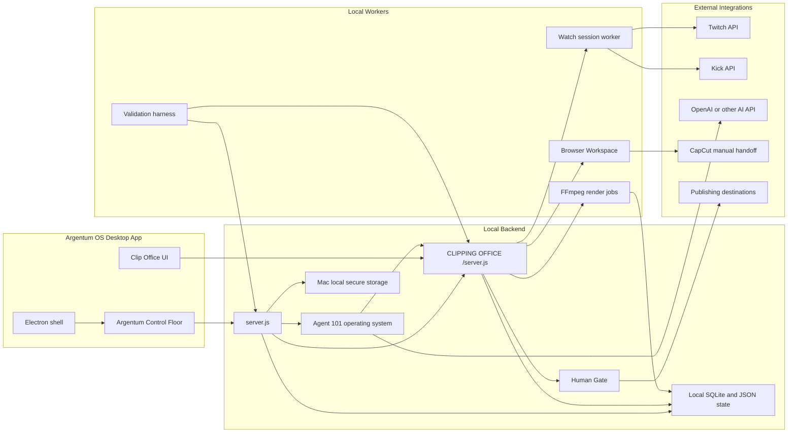

# Clip Office System Map

## Architecture

## Connected Workflow Chains

| UI screen | User action | Handler | API | Authorization | Persisted result | Worker or integration | UI status | Automated evidence |
| --- | --- | --- | --- | --- | --- | --- | --- | --- |
| Stream Watchlist | Scout streamers | `scoutStreamers` | `POST /api/agent101/runs` | Read-only provider metadata | `discoveredStreamers`, logs | Twitch/Kick metadata only | Scout results or provider blocker | `tests/local-desktop.test.js`, validation `api-*` |
| Stream Watchlist | Approve + watch live streamer | `approveMonitorAndWatch` | Human Gate approval plus watch session | Human Gate for streamer permission | `approvalRequests`, `watchSessions`, `watchEvents` | Watch worker | Monitoring, live, current stage | `tests/clipping-watch-windows.test.js` |
| Stream Watchlist | Pause/resume monitor | `watchSessionAction` | `POST /api/watch-sessions/:id/:action` | Local operator action | `watchSessions`, `watchEvents` | Watch worker lease | Paused/reconnecting/watching | validation `queue-*` |
| Clip Radar | Refresh candidates | `refresh` | `GET /api/clip-candidates` | Local authenticated app | `clipCandidates` coverage repaired when needed | Watch worker | Current candidates | `tests/clipping-watch-windows.test.js` |
| Clip Radar | Select and bulk delete clips | `deleteSelectedCandidates` | `POST /api/clip-candidates/bulk-delete` | Destructive local confirmation | Candidate removal, feedback cleanup, audit logs | Watch coverage repair | Counts refresh after API success | `tests/clipping-watch-windows.test.js`, validation `ui-*` |
| Clip Radar | Open details/play | `renderClipPreviewModal` | Local state plus media playback routes | Local authenticated app | No mutation | Source playback or live embed | Playable video or source-pending detail | validation `ui-*` |
| Clip Radar | Send to Builder | `sendCandidateToBuilder` | `POST /api/clips/draft` | Local authenticated app | Posting draft or builder draft | None unless render requested | Builder queued | validation `ui-*` |
| Clip Builder | Render draft | `runStudioAction` | Clip project render routes | Verified playable source required | `mediaJobs`, `artifacts` | FFmpeg | Render state, artifact playback | validation `media-*` |
| Human Gate | Approve publishing/access | `gateApprove` | `POST /api/human-gate/approve` | Human decision required | Approval status, downstream state | Watch worker or posting handoff | Approved or blocked reason | `tests/clipping-watch-windows.test.js` |
| Agent 101 | Ask operational status | root Agent 101 chat/run | `POST /api/agent101/run` | Safe internal read automatic | Thread messages, artifacts, approvals | Agent 101 OS and Clip Office runner | Executive status report | `npm run eval:agent101` |

## Defect Rule

Any gap between UI action, backend route, authorization, persisted result, worker/integration, UI refresh, and test evidence is a production defect. External integrations that lack credentials must show an explicit blocker instead of success.
